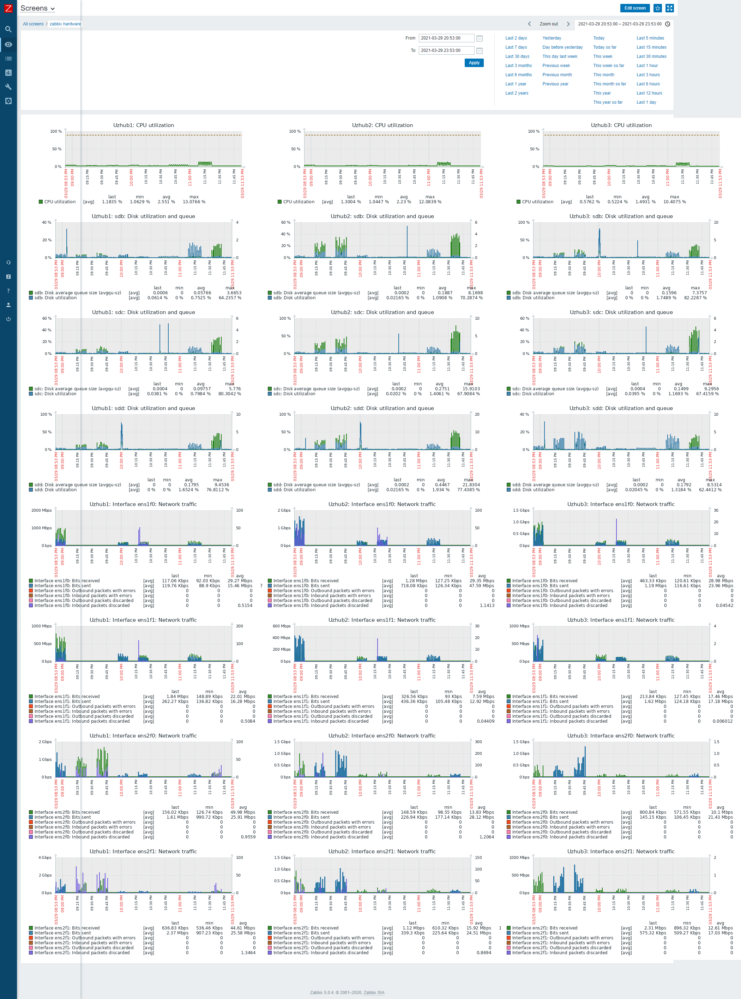

# Тестирование кластера ceph в различных режимах
___

Версия на момент тестированияceph version 15.2.5 (2c93eff00150f0cc5f106a559557a58d3d7b6f1f) octopus (stable). Кластер ceph состоял из 3-ех одинаковых серверов:

### Конфигурация серверов
* CPU 2 x Intel(R) Xeon(R) CPU E5-2670 v2 @ 2.50GHz
* RAM 8 x description: DIMM DDR3 Synchronous Registered (Buffered) 1600 MHz (0,6 ns)                                                                                                      
             product: 713756-081                                                                                                                                                             
             vendor: HP                                                                                                                                                                      
             physical id: 8                                                                                                                                                                  
             slot: PROC  1 DIMM  9                                                                                                                                                           
             size: 16GiB                                                                                                                                                                     
             width: 64 bits                                                                                                                                                                  
             clock: 1600MHz (0.6ns)
* SSD 3 x INTEL SSDSC2KB96, 480 GB Каждый под управлением контроллера Smart Array P420i как RAID 0(отдельные диски данный контроллер не поддреживает)
* NET 4 x OneConnect 10Gb NIC (be3) (rev 01) Для ceph использовались две сети: public_network(ens2f1 ens2f0) и cluster_network(ens1f1 ens1f0). На каждую были выделены по два 10G инетфейса объедененные в bond. Суммарной пропускной способностью 20G. Что подтвердили тесты iperf в два и более потоков. В качестве коммутаторов использовались два свитча cisco Nexus5010 с настроенным VPC.

### Конфигурация серверов
1. Тест в нормальном режиме работы с тремя нодами [test.log](test.log)
2. Тест в деградирующем режиме с двумя нодами, третья ноды выключалась жестко по питанию при использования IPMI [test.log.degraded](test.log.degraded).
3. Тест в режиме восстановления, включалась третья нода и одновременно запускались тесты [test.log.restore](test.log.restore).

### Скрипты тестирования
[test.sh](test.sh)
[test2.sh](test2.sh)

___
## Заключение
В деградирующем режиме ни какой просадки производительности не наблюдалось. Загрузка сетевых каналов в бондинге была практически равномерной (использовались оба линка). Максимальная загрузка линков была в районе 5Gbit/s на каждый, общей пропускной способностью 10Gbit/s. Из чего делаем вывод что обычные SSD SATA диски по 3 штуки на железную ноду способны утилизировать 10Gbit сеть!  При тестах во время восстановления производительность ceph-а снизилась на 40-50%. Что было крайне предсказуемо. Поскольку нагрузка разделилась поровну между тестами и синхронизацией. 

